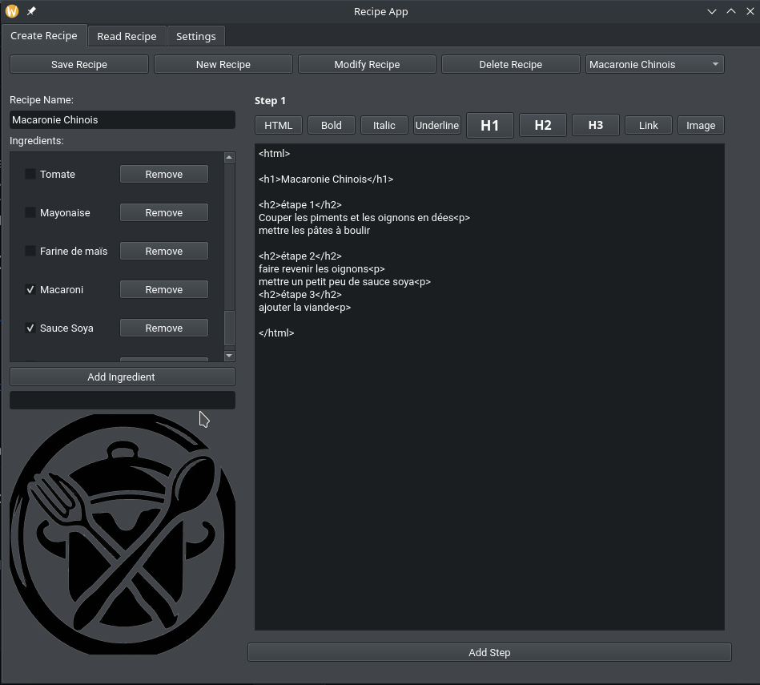
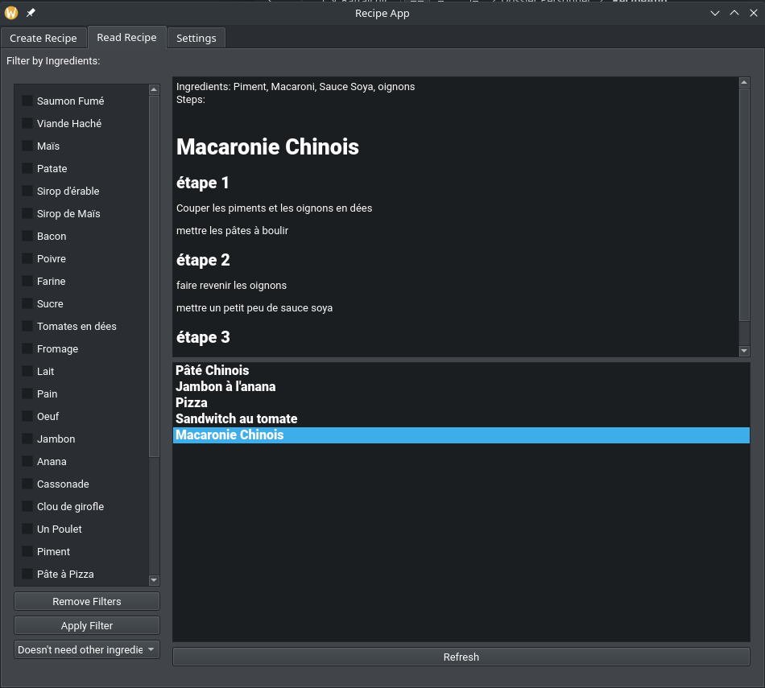
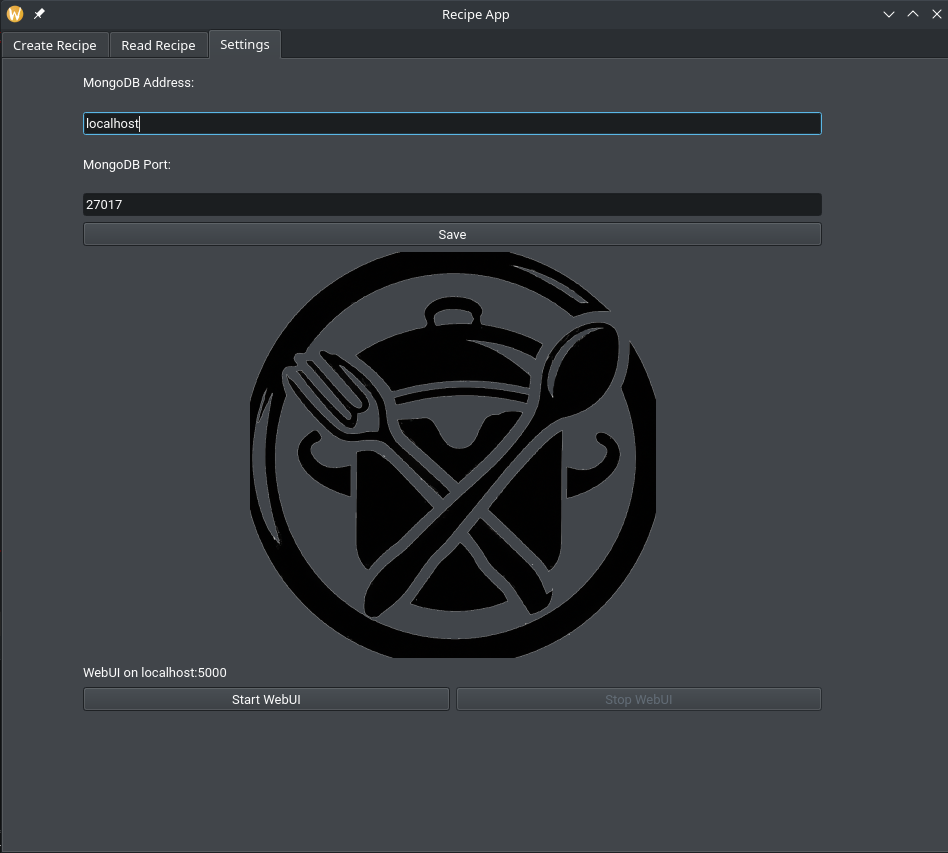
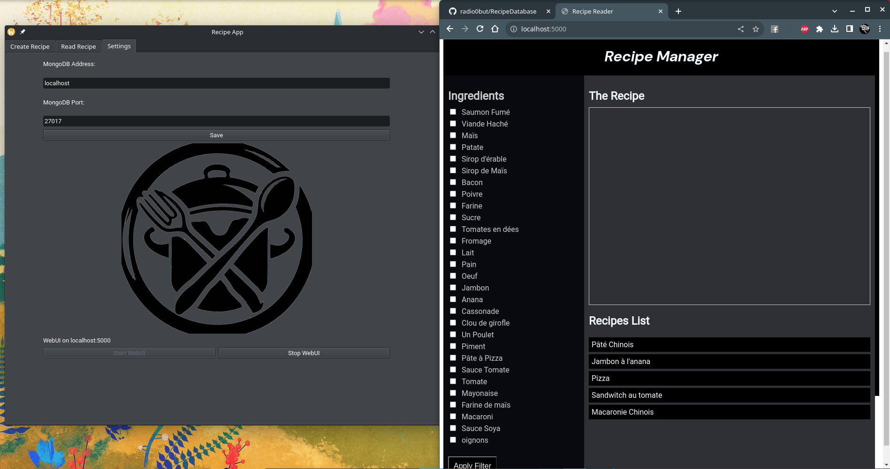

# Recipe App

Recipe App is a comprehensive tool designed to help users manage their recipes. The application provides an intuitive interface for creating, reading, and managing recipes. Users can also filter recipes based on specific ingredients, ensuring they always find what they're looking for. For those who prefer a web-based approach, a `webUI.py` is also provided to access and manage the recipes via a browser.






## Table of Contents
- [Installation](#installation)
  - [Dependencies](#dependencies)
  - [MongoDB Setup](#mongodb-setup)
- [Usage](#usage)
  - [Launching the App](#launching-the-app)
  - [Using Web UI](#using-web-ui)

## Installation

### Dependencies

#### Windows

1. Install Python from the [official website](https://www.python.org/downloads/).
2. Using pip (Python package installer), install the required packages:

```
pip install PySide6 flask flask_socketio pymongo
```

#### macOS

1. Install Python using Homebrew:

```
brew install python
```

2. Install the required packages:

```
pip3 install PySide6 flask flask_socketio pymongo
```

#### Ubuntu

1. Update the package list and install Python:

```
sudo apt update
sudo apt install python3 python3-pip
```

2. Install the required packages:

```
pip3 install PySide6 flask flask_socketio pymongo
```

#### Arch Linux

1. Update the package list and install Python:

```
sudo pacman -Sy python python-pip
```

2. Install the required packages:

```
pip install PySide6 flask flask_socketio pymongo
```

#### Fedora

1. Install Python:

```
sudo dnf install python3 python3-pip
```

2. Install the required packages:

```
pip3 install PySide6 flask flask_socketio pymongo
```

### MongoDB Setup

#### Windows

1. Download the MongoDB installer from the [official website](https://www.mongodb.com/try/download/community).
2. Follow the installation wizard to install.

#### macOS

1. Use Homebrew:

```
brew tap mongodb/brew
brew install mongodb-community@5.0
```

2. Start the MongoDB server:

```
brew services start mongodb/brew/mongodb-community
```

#### Ubuntu

1. Import the public key:

```
wget -qO - https://www.mongodb.org/static/pgp/server-5.0.asc | sudo apt-key add -
```

2. Create a list file for MongoDB:

```
echo "deb [ arch=amd64,arm64 ] https://repo.mongodb.org/apt/ubuntu focal/mongodb-org/5.0 multiverse" | sudo tee /etc/apt/sources.list.d/mongodb-org-5.0.list
```

3. Reload local package database:

```
sudo apt update
```

4. Install MongoDB packages:

```
sudo apt install -y mongodb-org
```

5. Start MongoDB:

```
sudo systemctl start mongod
```

#### Arch Linux

1. Install MongoDB:

```
yay -S mongodb-bin
```

2. Start MongoDB:

```
sudo systemctl start mongodb
```

#### Fedora

1. Install MongoDB:

```
sudo dnf install mongodb mongodb-server
```

2. Start MongoDB:

```
sudo systemctl start mongod
```

## Usage

### Launching the App

Before you launch the app, make sure you have installed all the necessary dependencies and set up MongoDB as mentioned in the installation section.

1. Navigate to the directory containing the app via the terminal or command prompt.
2. Run the `main.py` file:

```
python main.py
```

The app comprises several tabs: Create Recipe, Read Recipe, and Settings. Here is how you can use each of them:

#### Create Recipe Tab

1. **Recipe Name:** Specify a unique name for your recipe.
2. **Ingredients:** 
    - **Adding New Ingredients:** 
        - Before linking ingredients to a recipe, they need to be added to the database.
        - To add a new ingredient, type the ingredient name into the 'Add Ingredient' text box and submit. This will store the ingredient in the database for future use.
        - Ensure you create each ingredient only once. After its initial creation, you don't need to add it again. 
    - **Linking Ingredients to a Recipe:** 
        - After adding ingredients to the database, you can link them to your recipe. 
        - Search for ingredients by typing the name in the ingredient search box. Matching ingredients from the database will appear.
        - Select the desired ingredients by checking their respective boxes.
        - Specify the quantity or amount for each selected ingredient.
3. **Steps:** Outline the step-by-step procedure for the recipe. You can add steps sequentially.
4. After filling in all the details, click the 'Save' button to store the recipe in the database.

#### Read Recipe Tab

1. **Browse Recipes:** View a list of all available recipes in the database. You can scroll through the list to find what you're looking for.
2. **View Details:** Click on a recipe to view its complete details, including ingredients and steps.
3. **Filter Recipes:** 
    - Use the filter functionality to narrow down recipes based on specific ingredients.
    - In the 'Filter by Ingredients' section, type ingredient keywords. The system will show recipes containing those ingredients.
    - You can filter recipes both in the web interface and the desktop application. The filtering process is consistent across both platforms.


#### Settings Tab

In the settings tab, you have the option to configure the database connection.

1. **Database Host:** Specify the host where your MongoDB is running. By default, it is set to localhost.
2. **Database Port:** Specify the port on which MongoDB is listening. The default port is 27017.
3. After specifying the host and port, click the 'Save' button to save the settings.

### Configuring Database Connection Manually

In case you wish to configure the database connection manually or if your MongoDB is hosted on a different server, you can create a `config.json` file in the same directory as your app files with the following structure:

```
{
    "db_host": "your_database_host",
    "db_port": your_database_port
}
```

- Replace `your_database_host` with the actual host where your MongoDB is hosted. It could be a local or remote IP address or a domain name.
- Replace `your_database_port` with the actual port number where MongoDB is listening.

For instance, if your MongoDB is hosted on a remote server, your `config.json` might look something like this:

```
{
    "db_host": "192.168.1.100",
    "db_port": 27017
}
```

Save this file and launch the app. It will now connect to the MongoDB instance as per the details provided in the `config.json` file.

## Using Web UI

To use the app via the Web UI:

1. Navigate to the directory containing the `webUI.py` file in the terminal or command prompt.
2. Start the Flask server by running:

```
python webUI.py
```

3. Open a web browser and visit `http://localhost:5000` to access the web interface. Here, you can:
   - Browse through the list of available recipes.
   - View detailed information of a specific recipe by clicking on it.
   - Filter recipes based on ingredients.

Remember to check the terminal for any error messages or logs that can assist you in troubleshooting, if necessary.

---

Enjoy exploring and creating delightful recipes with the Recipe App!
